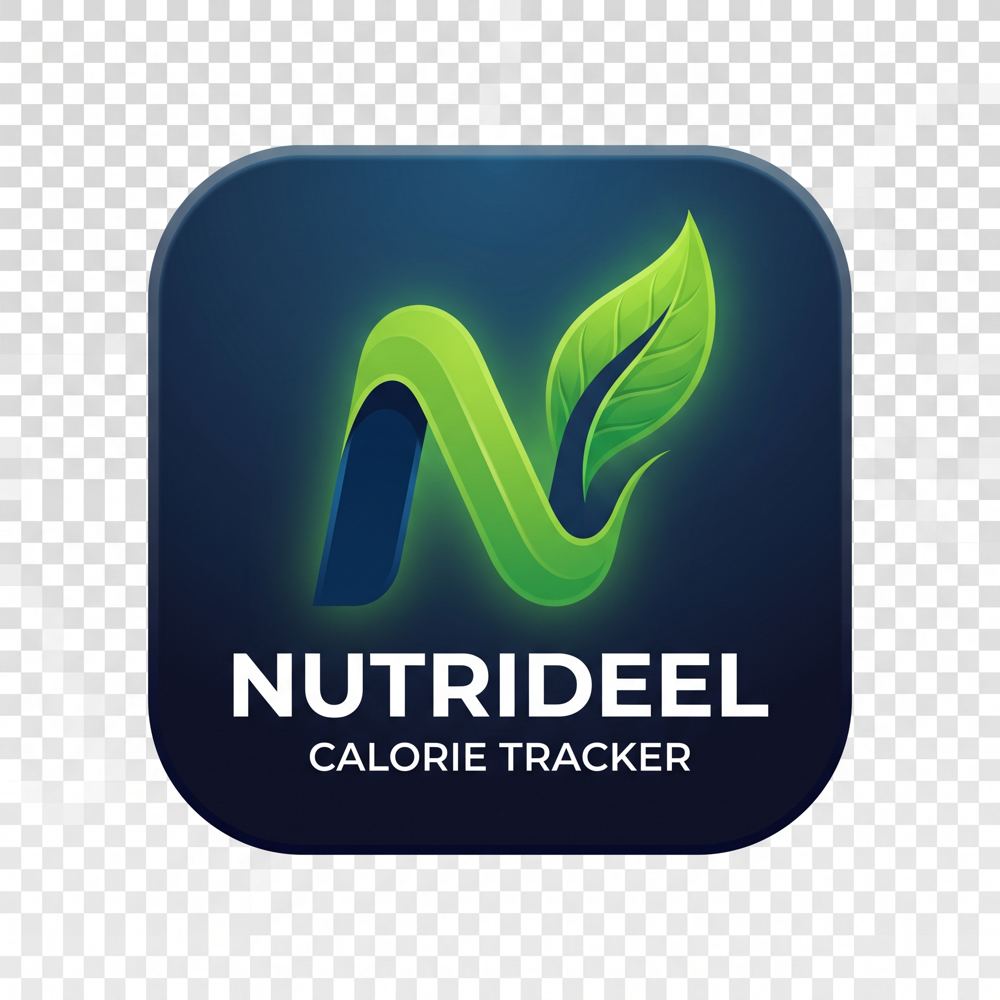

<div align="center">



# Nutrideel

**A private, offline-first calorie and nutrition tracker for Android, built with React Native and Expo.**

[](./LICENSE)
[](https://expo.dev)
[](https://www.typescriptlang.org/)

</div>

---

Nutrideel is a calorie and macro tracker I built as a portfolio project after getting tired of subscription-gated tracking apps. Everything runs on-device — no account, no backend, no analytics. The AI features (meal estimation, coaching chat) are optional and run on your own free Gemini API key, so there's nothing to sign up for and nothing to pay for.

## Screenshots

<div align="center">
<i>Screenshots coming soon.</i>
</div>

## Why I built it

Most calorie trackers either want a monthly fee, sell your data, or bury the actually useful features behind a paywall. I wanted something that:

- Keeps every log entirely on my phone
- Gives real AI-assisted food estimation without a subscription
- Actually shows me a weight/calorie trend instead of just a daily number
- Doesn't need an account to use

So I built it.

## Features

**Daily tracking**
- Log meals by describing them in plain English ("a bowl of chicken biryani") and get an instant AI or offline nutrition estimate
- Manual entry, saved foods, and saved combo meals (build a meal once, log it in one tap forever after)
- Weight, activity (steps/duration/calories burned), and fasting logging
- A "What If I Ate..." checker — build a hypothetical meal and see how it'd affect your day *before* committing to it

**Progress & history**
- SVG-charted weight, calorie, and step trends over 1 week to 3 months
- A thermodynamic 30-day weight forecast based on your actual logged intake, not just your stated goal
- Expandable day-by-day history with full macro breakdowns

**AI Coach**
- A chat interface that knows your real numbers — today's intake, your averages, your trends — and answers accordingly
- Pick from five current Gemini models, or run fully offline with a built-in heuristic engine that never needs a key or a connection
- Every AI feature degrades gracefully to offline mode on any error — nothing ever hard-fails

**The rest**
- Five-step onboarding that calculates your calorie/macro targets from your actual stats (Mifflin-St Jeor BMR, activity multiplier)
- Metric or imperial units, switchable anytime
- Local daily reminder notifications
- Haptic feedback and animated transitions throughout — this doesn't feel like a bare-bones tracker

## Tech stack

- **React Native + Expo** (SDK 51) — targets Android via EAS Build
- **TypeScript**, strict-ish, zero `any` outside a couple of storage edge cases
- **AsyncStorage** for local persistence, wrapped in a small in-memory cache so reads stay synchronous
- **react-native-svg** for the charts — no charting library dependency
- **Gemini API** (user-supplied key) for AI features, called directly from the device
- **expo-notifications**, **expo-haptics** for the native-feeling bits

No Redux, no navigation library — state lives in one root component and the five tabs are plain conditional renders. It's a small enough app that a router felt like overkill.

## Getting started

```bash
git clone https://github.com/adeelnotfound/nutrideel.git
cd nutrideel
npm install
npx expo start
```

Scan the QR code with Expo Go on your phone, or press `a` for an Android emulator.

### AI features (optional)

Nutrideel works fully offline out of the box. To turn on AI-powered meal estimation and coaching:

1. Grab a free key from [Google AI Studio](https://aistudio.google.com/apikey)
2. Open the app → Profile → paste it into the AI Coach section
3. Pick a model (Gemini 3.7 Flash is the default)

The key never leaves your device — it's used only to call Gemini's API directly.

## Building an APK

```bash
npm install -g eas-cli
eas login
eas build:configure
eas build -p android --profile preview
```

`preview` builds a plain `.apk`. `production` builds an `.aab` for Play Store submission.

## Project layout

```
nutrideel/
├── App.tsx                    # Entry point
├── src/
│   ├── RootNavigator.tsx      # Root state + tab/modal orchestration
│   ├── theme.ts                # Colors, spacing, shared design tokens
│   ├── types/                  # Shared TypeScript types
│   ├── utils/
│   │   ├── calculations.ts     # BMR/TDEE/macro/forecast math
│   │   ├── date.ts
│   │   └── haptics.ts
│   ├── services/
│   │   ├── storage.ts          # AsyncStorage data layer
│   │   ├── aiService.ts        # Offline engine + Gemini integration
│   │   └── notificationService.ts
│   ├── screens/
│   └── components/
│       ├── common/             # Modal, charts, toasts, pickers
│       ├── today/ history/ progress/ ai/ profile/ onboarding/
│       └── modals/             # Add/Edit food, weight, activity, fasting, etc.
└── assets/
```

## What's not in here (yet)

- No PDF import or CSV/JSON export — cut on purpose to keep the data model simple
- No unit tests — this was built fast and iterated on manually rather than TDD'd
- Notifications fire daily once enabled; there's no per-day-of-week filtering, since a single local trigger can't do that without a background scheduler
- No iOS build config tested — this targets Android via EAS, though the code itself isn't Android-specific

## License

MIT — see [LICENSE](./LICENSE). Do whatever you want with it.

---

<div align="center">
Built by <a href="https://github.com/adeelnotfound">Adeel Shaikh</a>
</div>
