<div align="center">


# Nutrideel

**A private, offline-first calorie and nutrition tracker for Android, built with React Native and Expo.**

[](./LICENSE)
[](https://expo.dev)
[](https://www.typescriptlang.org/)
[](./RELEASE_NOTES.md)

</div>

---

Nutrideel is a calorie and macro tracker built as a portfolio project, for people tired of subscription-gated tracking apps. Everything runs on-device — no account, no backend, no analytics. AI features (meal estimation, photo logging, coaching chat) are entirely optional and, if you turn them on, run on a key you supply to whichever provider you pick — there's nothing to sign up for with Nutrideel itself and nothing to pay it.

## Screenshots

<p align="center"> 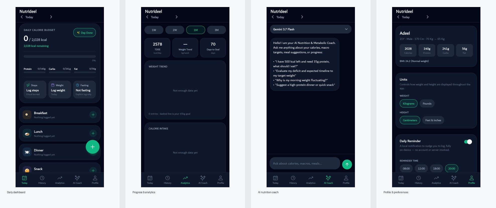 </p>

> Screenshots below are from an earlier build and predate the current multi-provider AI settings screen and typography — the flows are still accurate.

### Onboarding

<p align="center"> 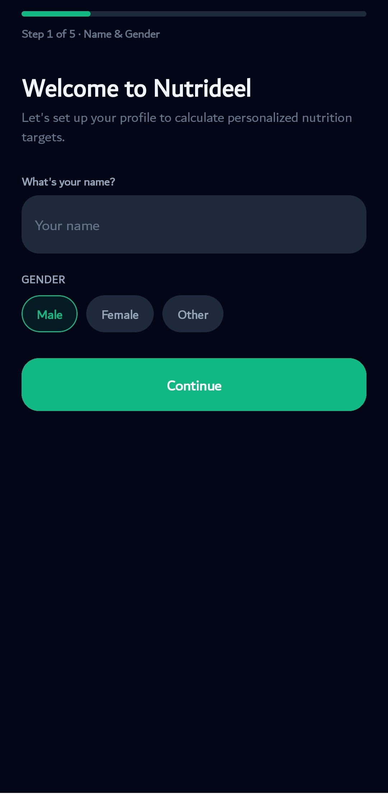 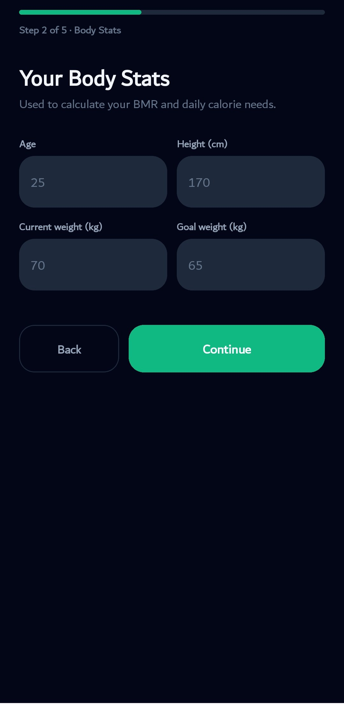 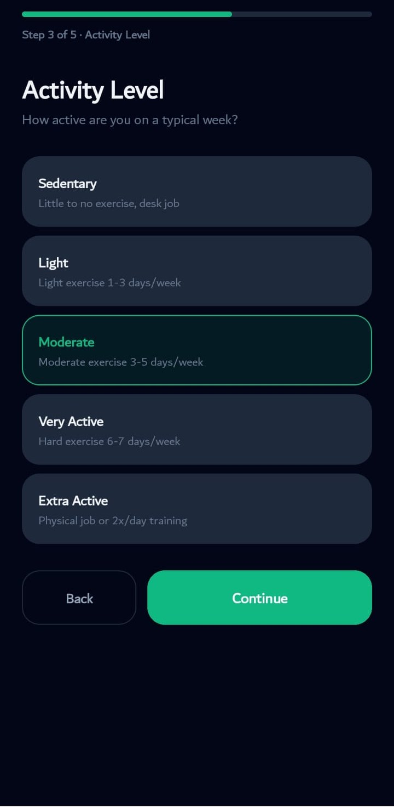 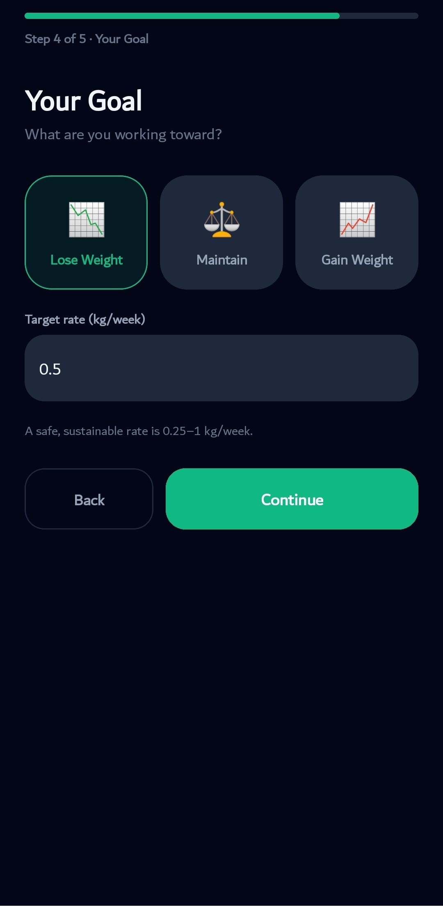 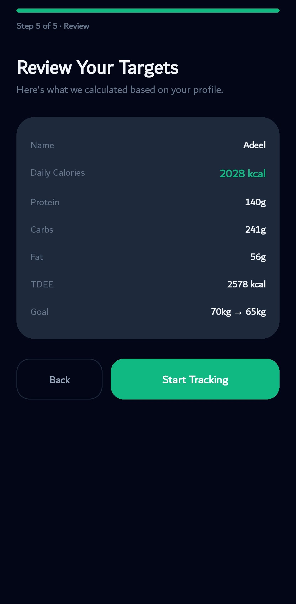 </p>

### Daily tracking & insights

<p align="center"> 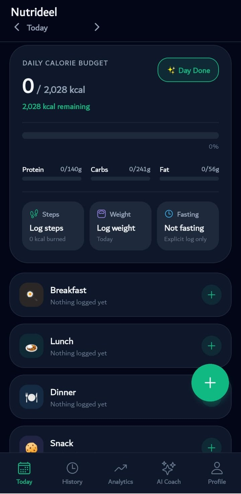 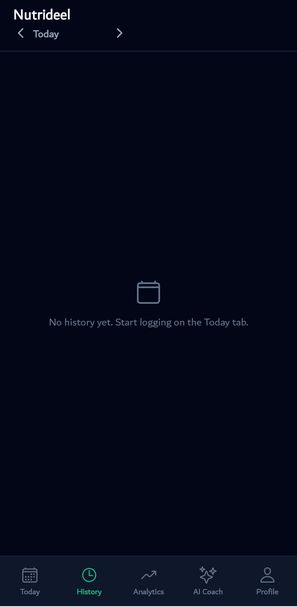 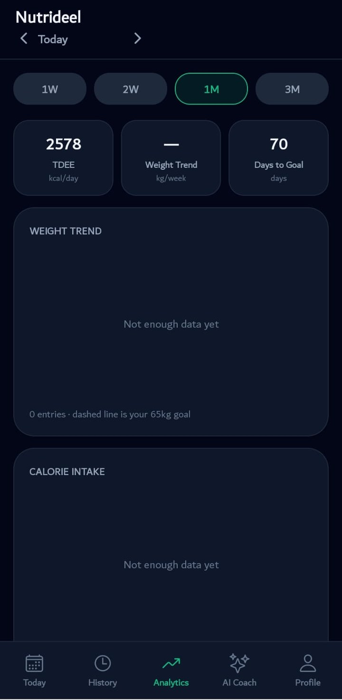 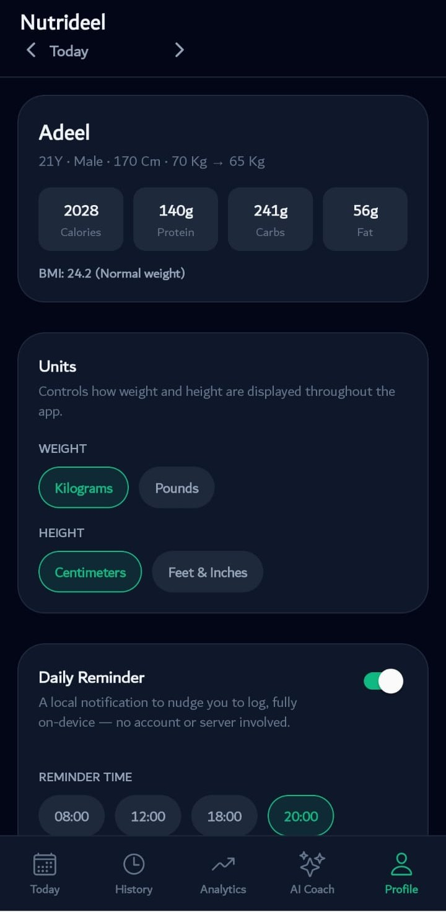 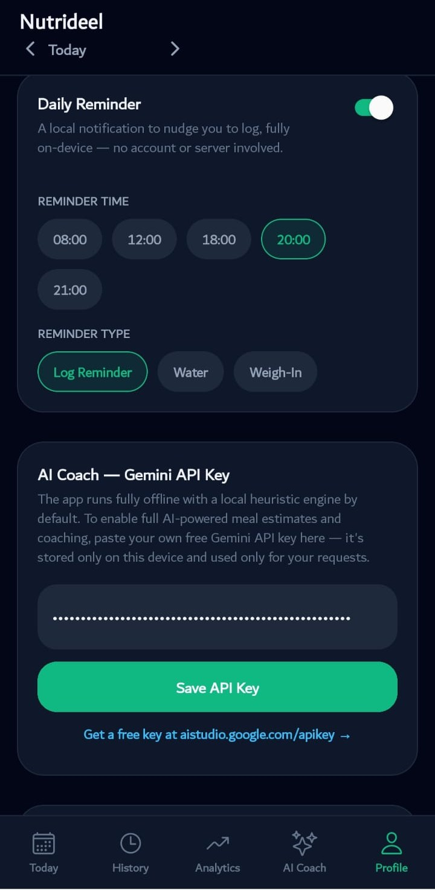 </p>

### AI coach

<p align="center"> 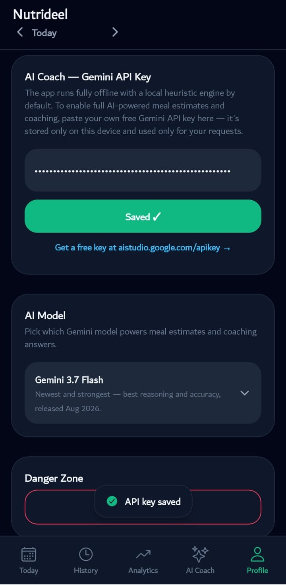 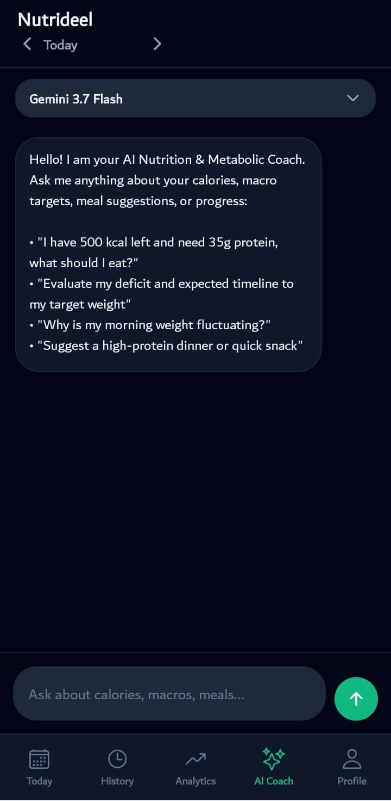 </p>

---

## Why it exists

Most calorie trackers either want a monthly fee, sell your data, or bury the actually useful features behind a paywall. Nutrideel keeps every log entirely on your phone, gives real AI-assisted food estimation without a subscription to Nutrideel itself, actually shows a weight/calorie trend instead of just a daily number, and never asks for an account.

## Features

**Daily tracking**
- Log meals by describing them in plain English ("a bowl of chicken biryani") and get an instant AI or offline nutrition estimate
- Photo-based food logging — snap or upload a photo and let a vision-capable model estimate the plate, or read a nutrition label directly
- Barcode scanning for packaged foods — scan an EAN-13/UPC-A barcode and pull real manufacturer nutrition data straight from Open Food Facts, no AI provider or key required; edit the logged quantity in grams and calories/macros rescale automatically
- Manual entry, saved foods, and saved combo meals (build a meal once, log it in one tap forever after) — saved foods and meals are browsable as Recents, Frequent (with a choice of all-time / 30-day / 90-day window), or Favorites, with search
- Weight, activity (steps/duration/calories burned), and fasting logging
- A "What If I Ate…" checker — build a hypothetical meal from typed descriptions or photos and see how it'd affect your day *before* committing to it
- Reminders: one daily nudge, or independent breakfast/lunch/dinner reminders each with their own time — your choice

**Progress & history**
- SVG-charted weight, calorie, and step trends over 1 week to 3 months
- A thermodynamic 30-day weight forecast based on your actual logged intake, not just your stated goal
- Expandable day-by-day history with full macro breakdowns

**AI Coach — bring your own key, from any of 13 providers**
- A chat interface that knows your real numbers — today's intake, your averages, your trends — and answers accordingly
- Clear the conversation any time with **New Chat**, and switch which model you're talking to mid-chat by tapping the provider badge in the header — no trip to Settings needed
- Suggested starter prompts on an empty chat so you're never staring at a blank box
- Choose from Google Gemini, OpenAI, Anthropic Claude, Groq, xAI Grok, OpenRouter, Mistral, DeepSeek, Together AI, Fireworks AI, DeepInfra, Perplexity, or any OpenAI-compatible custom endpoint (self-hosted, Ollama, LM Studio, etc.) — or run fully offline with the built-in offline engine, which never needs a key or a connection
- Optional **fallback provider**: configure a second provider that's tried automatically if your primary one fails, before ever dropping to offline
- Requests go straight from your device to the provider you pick; Nutrideel has no server in between and never sees your key
- API keys are encrypted at rest with `expo-secure-store` (backed by the Android Keystore / iOS Keychain), never stored in plain text
- Photo logging automatically falls back to a text-only estimate from your typed note on models without vision support, and to the offline engine if there's nothing usable to send
- Every AI feature degrades gracefully to offline mode on a genuine failure (bad key, rate limit, no signal) — and when it does, it tells you *why* rather than just showing a generic "offline" message

**The offline engine**
- ~85 recognized foods spanning South Asian mains, rice and grains, pasta, fast food, proteins, dairy and breakfast items, produce, and drinks — each with real per-100g macros
- Parses actual quantities out of what you type — "200g chicken breast," "2 eggs," "150ml milk," "3 slices of bread" — not just container words like "bowl" or "plate"
- Handles multi-ingredient meals: "chicken and rice" or "eggs, toast, and orange juice" get split into components, matched individually, and summed
- Falls back to a category-aware estimate (protein/carb/drink/snack/etc.) for anything unrecognized, rather than one fixed generic guess regardless of what was typed
- Tolerates small typos without silently falling through to the generic fallback
- Needs no API key, no account, and no network connection — this is what runs when you pick "Offline Engine" in AI Access, or automatically when an AI call fails

**The rest**
- Five-step onboarding that calculates your calorie/macro targets from your actual stats (Mifflin-St Jeor BMR, activity multiplier) — pick your preferred units (kg/lb/stone+lb, cm/ft+in) right from the first step
- Edit your name, age, height, weight, goal weight, and activity level any time after setup from Profile → Edit — your targets recalculate automatically unless you've set a custom target
- Six color themes, weight and height units switchable anytime from Profile (kilograms, pounds, or stone+pounds; centimeters or feet+inches)
- Local daily reminder notifications
- No vibration on every tap — haptics were tried and cut; the app is quiet by design
- Plus Jakarta Sans throughout instead of the OS default system font

## Tech stack

- **React Native + Expo** (SDK 51) — targets Android via EAS Build
- **TypeScript**, strict-ish, zero `any` outside a couple of storage edge cases
- **AsyncStorage** for local data, wrapped in a small in-memory cache so reads stay synchronous; **expo-secure-store** specifically for API keys
- **react-native-svg** for the charts — no charting library dependency
- 13 AI providers called directly from the device (see `src/services/aiProviders.ts` for the full registry and `src/services/aiService.ts` for the request layer)
- **expo-notifications** for reminders, **@expo-google-fonts/plus-jakarta-sans** for type

No Redux, no navigation library — state lives in one root component and the five tabs are plain conditional renders. It's a small enough app that a router felt like overkill.

## Getting started

```bash
git clone https://github.com/adeelnotfound/nutrideel.git
cd nutrideel
npm install
npx expo start
```

Scan the QR code with Expo Go on your phone, or press `a` for an Android emulator.

### AI features (optional)

Nutrideel works fully offline out of the box. To turn on AI-powered meal estimation, photo logging, and coaching:

1. Open the app → Profile → AI Access
2. Pick a provider from the list — each one links to where to grab a free or pay-as-you-go key
3. Paste in your key and pick a model

Your key is encrypted on-device and only ever sent directly to the provider you chose, in requests made from your phone.

## Building an APK

```bash
npm install -g eas-cli
eas login
eas build:configure
eas build -p android --profile preview
```

`preview` builds a plain `.apk` you can side-load. `production` builds an `.aab` for Play Store submission.

## Project layout

```
nutrideel/
├── App.tsx                        # Entry point, font loading, storage hydration
├── src/
│   ├── RootNavigator.tsx          # Root state + tab/modal orchestration
│   ├── theme.ts                   # Colors, spacing, shared design tokens (6 themes)
│   ├── types/                     # Shared TypeScript types
│   ├── utils/
│   │   ├── calculations.ts        # BMR/TDEE/macro/forecast math
│   │   ├── date.ts
│   │   ├── haptics.ts             # No-op shim — haptics are disabled app-wide
│   │   └── globalFont.ts          # Weight-aware custom font application
│   ├── services/
│   │   ├── storage.ts             # AsyncStorage data layer + encrypted key storage
│   │   ├── aiProviders.ts         # Registry of all 13 providers + the offline engine
│   │   ├── aiService.ts           # Multi-provider request dispatch + AI coach context
│   │   ├── offlineFoodEngine.ts   # Offline food estimation — dictionary, quantity parsing, fallback
│   │   └── notificationService.ts
│   ├── screens/
│   └── components/
│       ├── common/                # Modal, charts, toasts, AI Access settings card
│       ├── today/ history/ progress/ ai/ profile/ onboarding/   # profile/ includes EditProfileModal.tsx
│       └── modals/                # Add/Edit food, weight, activity, fasting, etc.
└── assets/
```

## Adding another AI provider

Every provider is a single entry in `src/services/aiProviders.ts` — no changes needed anywhere else. An entry needs an `apiFormat` (`'gemini' | 'openai' | 'anthropic'`, whichever request shape the provider speaks), a `baseUrl`, whether it needs a key, whether it supports vision, and a list of models. If a provider needs a genuinely new request shape, add a `callXFormat` function next to `callOpenAIFormat`/`callGeminiFormat`/`callAnthropicFormat` in `aiService.ts` and route to it from `callAIProvider`.

## Extending the offline engine

The offline dictionary lives entirely in `src/services/offlineFoodEngine.ts`. Adding a food is one entry in the `DISHES` array — keywords (including common misspellings/aliases), a category, per-100g macros, and a default serving size; countable foods (eggs, slices, roti) can also set `unitGrams`/`unitLabel` so "3 eggs" parses correctly. No other file needs to change.

## What's not in here (yet)

- No PDF import or CSV/JSON export — cut on purpose to keep the data model simple
- No unit tests — this was built fast and iterated on manually rather than TDD'd
- Notifications fire daily once enabled; there's no per-day-of-week filtering, since a single local trigger can't do that without a background scheduler
- No iOS build config tested — this targets Android via EAS, though the code itself isn't Android-specific

## License

MIT — see [LICENSE](./LICENSE). Do whatever you want with it.

---

<div align="center">
Built by <a href="https://github.com/adeelnotfound">Adeel Shaikh</a>
</div>
